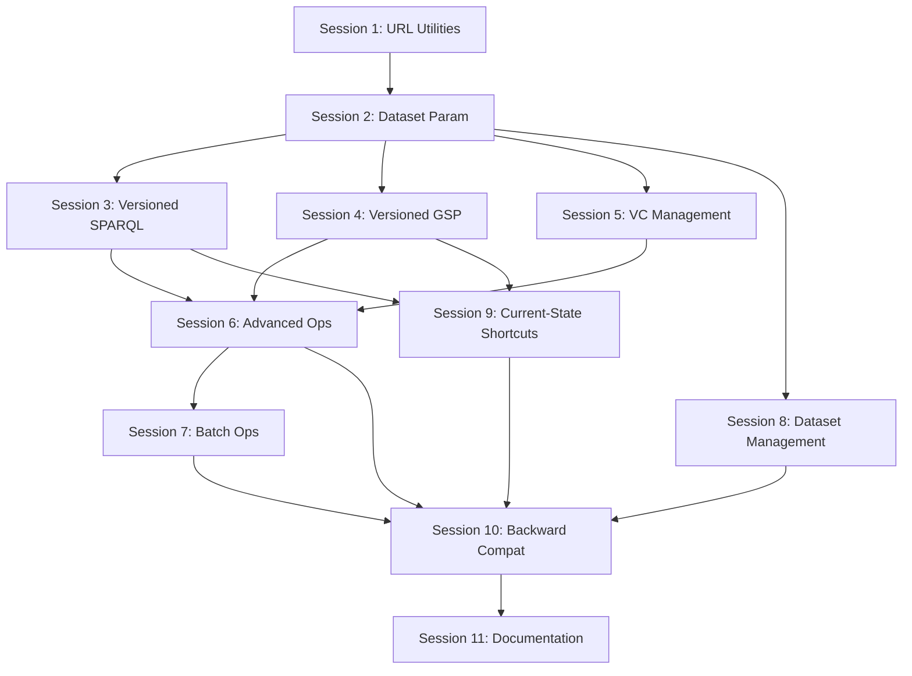

# Routing Refactoring - Task Roadmap

This directory contains task breakdowns for implementing semantic routing for CHUCC-server, making datasets, branches, and commits directly shareable via URL.

---

## Overview

**Goal:** Refactor endpoint routing from query-parameter style to path-based semantic URLs that follow Apache Jena Fuseki best practices with version control extensions.

**Documentation:** See [docs/architecture/semantic-routing.md](../../docs/architecture/semantic-routing.md) for complete specification.

**Status:** ⏳ Not Started

---

## Background

### Current Pattern (Query Parameters)
```
GET /sparql?dataset=mydata&branch=main&query=...
GET /data?dataset=mydata&commit=01936d8f...&graph=...
```

**Problems:**
- ❌ Not shareable (long query strings)
- ❌ Inconsistent (TagController uses path params)
- ❌ Not RESTful (resources not in URL path)
- ❌ Not discoverable

### Target Pattern (Path Segments)
```
GET /mydata/version/branches/main/sparql?query=...
GET /mydata/version/commits/01936d8f.../data?graph=...
GET /mydata/version/tags/v1.0/sparql?query=...
```

**Benefits:**
- ✅ Shareable and bookmarkable
- ✅ Immutable URLs for commits/tags (perfect for citations)
- ✅ RESTful resource hierarchy
- ✅ Fuseki-compatible pattern

---

## Task Breakdown

### Session 1: Foundation - URL Utilities and OpenAPI Updates
**File:** [session-1-url-utilities-and-openapi.md](./session-1-url-utilities-and-openapi.md)
**Status:** ⏳ Not Started
**Estimated Time:** 3-4 hours

**Deliverables:**
- `VersionControlUrls` utility class for URL construction
- OpenAPI spec updates with new path structures
- Response header helpers (`Content-Location`, `Link`)

**Why First:** Provides foundation for all subsequent tasks

---

### Session 2: Dataset Parameter Standardization
**File:** [session-2-dataset-parameter-standardization.md](./session-2-dataset-parameter-standardization.md)
**Status:** ⏳ Not Started
**Estimated Time:** 4-5 hours

**Deliverables:**
- Move dataset from query param to path variable across all controllers
- Align TagController with rest of codebase
- Update all integration tests
- Maintain backward compatibility with query param (deprecated)

**Why Second:** Establishes consistent dataset addressing before adding version routing

---

### Session 3: Versioned SPARQL Endpoints
**File:** [session-3-versioned-sparql-endpoints.md](./session-3-versioned-sparql-endpoints.md)
**Status:** ⏳ Not Started
**Estimated Time:** 5-6 hours

**Deliverables:**
- `GET/POST /{dataset}/version/branches/{name}/sparql`
- `GET/POST /{dataset}/version/commits/{id}/sparql`
- `GET/POST /{dataset}/version/tags/{name}/sparql`
- `POST /{dataset}/version/branches/{name}/update`
- Integration tests for all versioned SPARQL endpoints

**Why Third:** Core functionality for querying at specific versions

---

### Session 4: Versioned Graph Store Protocol Endpoints
**File:** [session-4-versioned-gsp-endpoints.md](./session-4-versioned-gsp-endpoints.md)
**Status:** ⏳ Not Started
**Estimated Time:** 5-6 hours

**Deliverables:**
- `GET /{dataset}/version/{ref}/data?graph={iri}`
- `PUT/POST/DELETE/PATCH /{dataset}/version/branches/{name}/data?graph={iri}`
- Integration tests for all versioned GSP endpoints
- Immutability enforcement (no writes to commits/tags)

**Why Fourth:** Extends GSP with version awareness

---

### Session 5: Version Control Management Endpoints
**File:** [session-5-version-control-management.md](./session-5-version-control-management.md)
**Status:** ⏳ Not Started
**Estimated Time:** 4-5 hours

**Deliverables:**
- `GET /{dataset}/version/branches/{name}` - Branch metadata
- `GET /{dataset}/version/commits/{id}` - Commit metadata
- `GET /{dataset}/version/tags/{name}` - Tag metadata
- Response includes navigational `Link` headers
- Integration tests

**Why Fifth:** Adds resource metadata endpoints for discoverability

---

### Session 6: Advanced Operations Routing
**File:** [session-6-advanced-operations-routing.md](./session-6-advanced-operations-routing.md)
**Status:** ⏳ Not Started
**Estimated Time:** 5-6 hours

**Deliverables:**
- `POST /{dataset}/version/branches/{target}/merge`
- `POST /{dataset}/version/branches/{name}/reset`
- `POST /{dataset}/version/branches/{name}/revert`
- `POST /{dataset}/version/branches/{name}/cherry-pick`
- `POST /{dataset}/version/branches/{name}/rebase`
- `POST /{dataset}/version/branches/{name}/squash`
- `GET /{dataset}/version/commits/{id1}/diff/{id2}`
- `GET /{dataset}/version/branches/{name}/history`
- Integration tests

**Why Sixth:** Refactors advanced operations to use new routing

---

### Session 7: Batch Operations Routing
**File:** [session-7-batch-operations-routing.md](./session-7-batch-operations-routing.md)
**Status:** ⏳ Not Started
**Estimated Time:** 3-4 hours

**Deliverables:**
- `POST /{dataset}/version/branches/{name}/batch-graphs`
- `POST /{dataset}/version/branches/{name}/batch`
- Integration tests
- Performance verification

**Why Seventh:** Batch operations benefit from explicit branch targeting

---

### Session 8: Dataset Management Endpoints
**File:** [session-8-dataset-management-endpoints.md](./session-8-dataset-management-endpoints.md)
**Status:** ⏳ Not Started
**Estimated Time:** 3-4 hours

**Deliverables:**
- `POST /datasets/{name}` - Create dataset
- `DELETE /datasets/{name}` - Delete dataset
- `GET /datasets` - List datasets
- `GET /datasets/{name}` - Dataset metadata
- Integration tests

**Why Eighth:** Dataset management uses new patterns from previous sessions

---

### Session 9: Current-State Shortcuts
**File:** [session-9-current-state-shortcuts.md](./session-9-current-state-shortcuts.md)
**Status:** ⏳ Not Started
**Estimated Time:** 4-5 hours

**Deliverables:**
- `GET/POST /{dataset}/sparql` - Query main HEAD (shortcut)
- `POST /{dataset}/update` - Update main branch (shortcut)
- `GET /{dataset}/data?graph={iri}` - GSP at main HEAD (shortcut)
- `PUT/POST/DELETE/PATCH /{dataset}/data?graph={iri}` - GSP operations
- Integration tests

**Why Ninth:** Convenience shortcuts after core versioned endpoints established

---

### Session 10: Backward Compatibility and Migration
**File:** [session-10-backward-compatibility.md](./session-10-backward-compatibility.md)
**Status:** ⏳ Not Started
**Estimated Time:** 4-5 hours

**Deliverables:**
- Maintain old query-param endpoints (marked as deprecated)
- Add `Deprecation` header to old endpoints
- Add `Content-Location` header pointing to new URLs
- Migration guide documentation
- Integration tests for both old and new patterns

**Why Tenth:** Ensures smooth migration path for existing clients

---

### Session 11: Documentation and Examples
**File:** [session-11-documentation-and-examples.md](./session-11-documentation-and-examples.md)
**Status:** ⏳ Not Started
**Estimated Time:** 3-4 hours

**Deliverables:**
- Update [docs/api/routing-guide.md](../../docs/api/routing-guide.md)
- Update all API documentation with new URL patterns
- Add example use cases (citations, reproducibility)
- Update OpenAPI Swagger UI with examples
- Migration guide for users

**Why Last:** Documentation after implementation complete

---

## Dependencies



**Critical Path:** S1 → S2 → S3/S4 → S6 → S10 → S11

---

## Testing Strategy

### Integration Test Pattern

For each session, create integration tests that verify:

1. **New pattern works:**
   ```java
   @Test
   void newPattern_shouldWork() {
     String url = "/mydata/version/branches/main/sparql?query=...";
     ResponseEntity<String> response = restTemplate.getForEntity(url, String.class);

     assertThat(response.getStatusCode()).isEqualTo(HttpStatus.OK);
     assertThat(response.getHeaders().get("Content-Location"))
       .contains("/mydata/version/branches/main");
   }
   ```

2. **Old pattern still works (backward compat):**
   ```java
   @Test
   void oldPattern_shouldStillWork() {
     String url = "/sparql?dataset=mydata&branch=main&query=...";
     ResponseEntity<String> response = restTemplate.getForEntity(url, String.class);

     assertThat(response.getStatusCode()).isEqualTo(HttpStatus.OK);
     assertThat(response.getHeaders().get("Content-Location"))
       .contains("/mydata/version/branches/main"); // Points to new URL
   }
   ```

3. **Response headers correct:**
   ```java
   assertThat(response.getHeaders().get("Content-Location")).isNotNull();
   assertThat(response.getHeaders().get("Link")).isNotNull();
   ```

---

## Quality Gates

Each session must pass:

- ✅ All unit tests pass
- ✅ All integration tests pass
- ✅ Zero Checkstyle violations
- ✅ Zero SpotBugs warnings
- ✅ Zero PMD violations
- ✅ Zero compiler warnings
- ✅ OpenAPI spec validates
- ✅ Backward compatibility maintained (if applicable)

**Command:**
```bash
mvn -q clean install
```

---

## Progress Tracking

| Session | Status | Estimated | Actual | Completion Date |
|---------|--------|-----------|--------|-----------------|
| 1. URL Utilities | ⏳ Not Started | 3-4h | - | - |
| 2. Dataset Param | ⏳ Not Started | 4-5h | - | - |
| 3. Versioned SPARQL | ⏳ Not Started | 5-6h | - | - |
| 4. Versioned GSP | ⏳ Not Started | 5-6h | - | - |
| 5. VC Management | ⏳ Not Started | 4-5h | - | - |
| 6. Advanced Ops | ⏳ Not Started | 5-6h | - | - |
| 7. Batch Ops | ⏳ Not Started | 3-4h | - | - |
| 8. Dataset Management | ⏳ Not Started | 3-4h | - | - |
| 9. Current-State Shortcuts | ⏳ Not Started | 4-5h | - | - |
| 10. Backward Compat | ⏳ Not Started | 4-5h | - | - |
| 11. Documentation | ⏳ Not Started | 3-4h | - | - |
| **TOTAL** | | **43-54h** | - | - |

**Estimated Total:** 43-54 hours (~6-7 full working days)

---

## Related Documentation

- **[Semantic Routing Specification](../../docs/architecture/semantic-routing.md)** - Executive summary
- **[Full Routing Proposal](/tmp/routing-concept-proposal.md)** - Detailed analysis (800+ lines)
- **[API Extensions](../../docs/api/api-extensions.md)** - Current API documentation
- **[CQRS + Event Sourcing](../../docs/architecture/cqrs-event-sourcing.md)** - Architecture fundamentals

---

## Notes

- **Backward compatibility is critical** - All old query-param patterns must continue working
- **Follow TDD** - Write integration tests before implementation
- **Use quality gates** - Run `mvn -q clean install` after each session
- **Update OpenAPI specs** - Keep API documentation in sync
- **Add `Content-Location` headers** - Help clients discover new URLs

---

**Created:** 2025-11-06
**Author:** Claude (Anthropic)
**Status:** Ready for implementation
